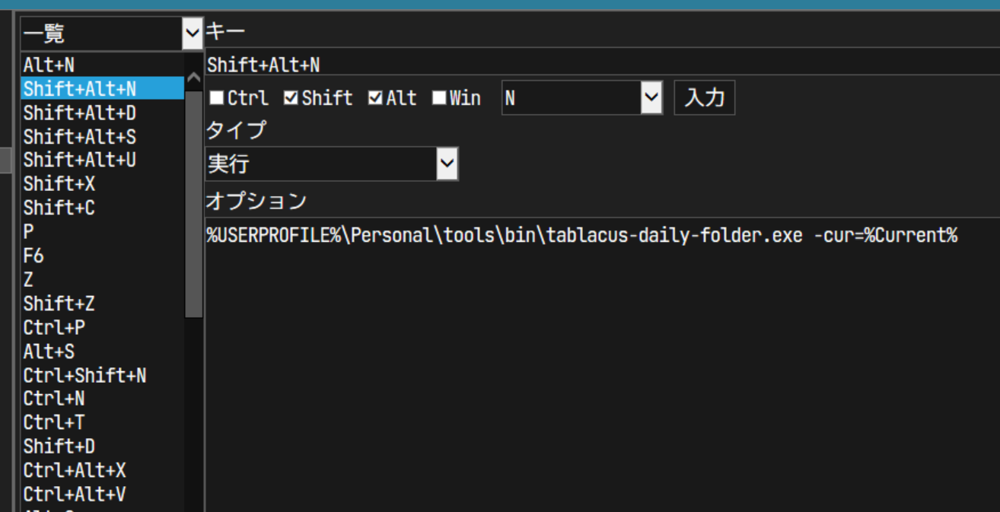

# README

Command line tool for [Tablacus Explorer](https://tablacus.github.io/explorer.html).

- Show menu to select folder name prefix.
- Make new folder with selected prefix and timestamp ( `yyyyMMdd_[prefix]_[name]` ).
    - Names are defined with `rule.yml` in the folder.
    - Without `rule.yml`, only timestamped-folder ( `yyyyMMdd_[name]` ) is created.

