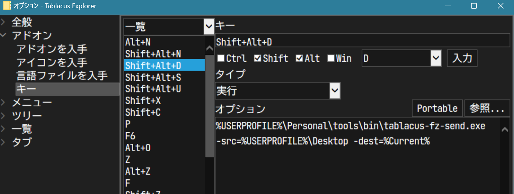

# README

Command line tool for [Tablacus Explorer](https://tablacus.github.io/explorer.html).

- List up files on specified directory (default: `Desktop`) and select with fuzzy-finder.
- Copy / move selected items to specified destination.
    - Items are copied / moved to the root of destination.


## Examples




### Fetch from desktop

```
%USERPROFILE%\Personal\tools\bin\tablacus-fz-send.exe -src=%USERPROFILE%\Desktop -dest=%Current%
```

### Fetch from scan folder

```
%USERPROFILE%\Personal\tools\bin\tablacus-fz-send.exe -src=X:\scan -dest=%Current%
```

### Fetch from parent folder

```
%USERPROFILE%\Personal\tools\bin\tablacus-fz-send.exe -src=.. -dest=%Current%
```

### Send to subfolder

```
%USERPROFILE%\Personal\tools\bin\tablacus-fz-send.exe -src=%Current%
```

### Send to trash (`_obsolete`)

```
%USERPROFILE%\Personal\tools\bin\tablacus-fz-send.exe -src=%Current% -dest=_obsolete
```

